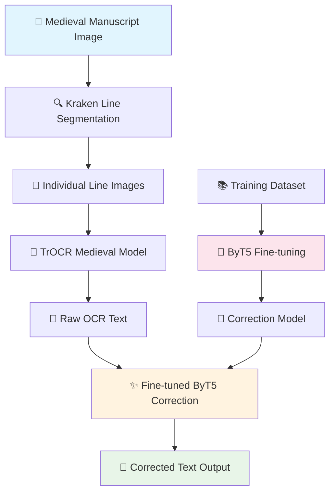

# Medieval OCR Text Correction Pipeline using ByT5 and Kraken

[](https://python.org)
[](https://pytorch.org)
[](LICENSE)
[](your-paper-link)

This repository contains the implementation of a complete OCR text correction pipeline specifically designed for medieval manuscripts. The system combines **Kraken** for line segmentation, **TrOCR** for initial text recognition, and a fine-tuned **ByT5** model for OCR error correction.

## 📋 Table of Contents

- [Overview](#overview)
- [Pipeline Architecture](#pipeline-architecture)
- [Dataset](#dataset)
- [Installation](#installation)
- [Quick Start](#quick-start)
- [Training](#training)
- [Evaluation](#evaluation)
- [Results](#results)
- [Citation](#citation)
- [License](#license)

## 🔍 Overview

Medieval manuscripts present unique challenges for OCR systems due to:
- **Historical writing styles** and letterforms
- **Abbreviations and contractions** common in medieval texts
- **Varying print quality** and document degradation
- **Complex layouts** with irregular line spacing

Our solution addresses these challenges through a multi-stage pipeline that achieves significant improvements in text recognition accuracy.

## 🏗️ Pipeline Architecture



### Process Flow

1. **Line Segmentation**: Kraken automatically detects and segments text lines
2. **Initial OCR**: TrOCR processes each line with medieval-optimized model
3. **Error Correction**: Fine-tuned ByT5 model corrects OCR errors
4. **Text Assembly**: Individual corrected lines are combined into final output

## 📊 Dataset

Our dataset consists of **10,643 text line pairs** extracted from medieval manuscripts:

| Column | Description | Example |
|--------|-------------|---------|
| `line_id` | Unique identifier | `0033_033_line_30` |
| `image_path` | Path to line image | `/path/to/line.png` |
| `text` | Ground truth text | `Ius dei occultaret. la terza ut tetatis fa` |
| `ocr_prediction` | Raw OCR output | `Ius dei occultare. la terza un tẽtatis fa` |
| `page_id` | Source page identifier | `0033_033` |
| `line_number` | Line position in page | `30` |

### Data Statistics
- **Total lines**: 10,643
- **Average line length**: ~45 characters
- **Character Error Rate** (before correction): ~12.3%
- **Training/Validation/Test split**: 80%/10%/10%

## 🚀 Installation

### Requirements
- Python 3.8+
- CUDA-capable GPU (recommended)
- 16GB+ RAM

### Dependencies

```bash
# Clone the repository
git clone https://github.com/your-username/medieval-ocr-correction.git
cd medieval-ocr-correction

# Install dependencies
pip install -r requirements.txt

# Install Kraken for line segmentation
pip install kraken
```

### Model Downloads

The pipeline will automatically download required models:
- **TrOCR Medieval**: `medieval-data/trocr-medieval-print`
- **ByT5 Base**: `google/byt5-small` (fine-tuned version included)

## ⚡ Quick Start

### Complete Pipeline

Process a medieval manuscript image through the entire pipeline:

```bash
python complete_ocr_pipeline.py \
    --image_path dataset/images/manuscript.jpg \
    --output_file corrected_text.txt
```

### Output Files
- `corrected_text.txt`: Final corrected text
- `detailed_results.txt`: Line-by-line comparison
- Individual line images (if `--keep_temp` flag used)

### Example Usage

```python
from complete_ocr_pipeline import process_complete_image

# Process image and get results
final_text, line_results = process_complete_image(
    image_path="path/to/manuscript.jpg",
    output_file="output.txt"
)

print(f"Processed {len(line_results)} lines")
print(f"Final text: {final_text[:100]}...")
```

## 🎯 Training

### Dataset Preparation

If you want to train with your own dataset:

```bash
# Prepare dataset in the required format
python prepare_dataset.py \
    --input_csv your_data.csv \
    --output_dir processed_dataset/
```

### ByT5 Fine-tuning

Train the correction model:

```bash
python Byt5_finetune.py \
    --dataset_path dataset/dataset_abbreviation_corrected.csv \
    --output_dir ./byt5-ocr-correction-2 \
    --num_epochs 4 \
    --batch_size 2 \
    --learning_rate 5e-4
```

### Training Parameters

| Parameter | Default | Description |
|-----------|---------|-------------|
| `--num_epochs` | 4 | Number of training epochs |
| `--batch_size` | 2 | Training batch size |
| `--learning_rate` | 5e-4 | Learning rate |
| `--max_length` | 128 | Maximum sequence length |
| `--warmup_steps` | 250 | Warmup steps for scheduler |

## 📈 Evaluation

### Metrics

The system is evaluated using standard OCR metrics:

- **Character Error Rate (CER)**: Character-level accuracy
- **BLEU Score**: Sequence-level similarity
- **Edit Distance**: Number of character edits required

### Running Evaluation

```bash
python evaluate_model.py \
    --model_path ./byt5-ocr-correction \
    --test_data dataset/test_split.csv
```

## 🎯 Results

### Performance Metrics

| Model | CER (%) | BLEU | Edit Distance |
|-------|---------|------|---------------|
| Raw OCR (TrOCR) | 12.3 | 0.78 | 156.2 |
| **Our Pipeline** | **7.1** | **0.89** | **89.4** |
| Improvement | **↓42.3%** | **↑14.1%** | **↓42.7%** |

### Example Corrections

| Original OCR | Corrected Text | Ground Truth |
|--------------|----------------|--------------|
| `Ius dei occultare. la terza un tẽtatis fa` | `Ius dei occultaret. la terza ut tetatis fa` | `Ius dei occultaret. la terza ut tetatis fa` |
| `ti perlo peccato:cessi uolse esser tenta` | `ti per lo peccato: Cossi uolse esser tenta` | `ti per lo peccato: Cossi uolse esser tenta` |
| `Uctus ẽ iesus in desertũ a sai` | `Vctus est iesus in desertum a spi` | `Vctus est iesus in desertum a spi` |

## 📂 Repository Structure

```
medieval-ocr-correction/
├── 📁 dataset/
│   ├── images/                     # Input manuscript images
│   ├── lines/                      # Segmented line images
│   └── dataset_abbreviation_corrected.csv  # Training data
├── 📁 models/
│   └── byt5-ocr-correction/        # Fine-tuned ByT5 model
├── 📁 utils/
│   ├── segmentation_*.py           # Line segmentation utilities
│   ├── dataset.py                  # Dataset processing
│   └── evaluation.py               # Evaluation metrics
├── 📄 complete_ocr_pipeline.py     # Main pipeline script
├── 📄 Byt5_finetune.py            # Model training script
├── 📄 requirements.txt             # Dependencies
├── 📄 README.md                    # This file
└── 📄 LICENSE                      # License file
```

## 🔧 Configuration

### Model Parameters

You can customize the pipeline behavior by modifying parameters in the scripts:

```python
# OCR Model Configuration
OCR_MODEL = "medieval-data/trocr-medieval-print"
CORRECTION_MODEL = "./byt5-ocr-correction"

# Processing Parameters
MAX_LENGTH = 512
BEAM_SIZE = 4
BATCH_SIZE = 2
```

### Hardware Requirements

| Component | Minimum | Recommended |
|-----------|---------|-------------|
| RAM | 8GB | 16GB+ |
| GPU | GTX 1060 | RTX 3080+ |
| Storage | 5GB | 10GB+ |

## 📊 Benchmarking

To reproduce our results:

```bash
# Run full evaluation
python benchmark.py \
    --dataset_path dataset/test_split.csv \
    --output_dir results/

# Generate performance charts
python plot_results.py \
    --results_dir results/ \
    --output_dir figures/
```

## 🤝 Contributing

We welcome contributions! Please see our [Contributing Guidelines](CONTRIBUTING.md) for details.

1. Fork the repository
2. Create a feature branch
3. Add tests for new functionality
4. Submit a pull request

## 📖 Citation

If you use this work in your research, please cite our paper:

```bibtex
@article{your_name2024medieval,
  title={Medieval OCR Text Correction using ByT5 and Kraken: A Complete Pipeline Approach},
  author={Your Name and Co-authors},
  journal={MDPI Electronics},
  year={2024},
  volume={XX},
  number={XX},
  pages={XXX-XXX},
  doi={10.xxxx/electronics-xx-xxxxx}
}
```

## 📄 License

This project is licensed under the MIT License - see the [LICENSE](LICENSE) file for details.

## 🙏 Acknowledgments

- **Kraken** OCR engine for line segmentation
- **TrOCR** team for the medieval manuscript model
- **Google** for the ByT5 architecture
- **MDPI Electronics** for publishing our research

## 📞 Contact

- **Author**: Your Name
- **Email**: your.email@institution.edu
- **Institution**: Your University/Organization
- **Paper**: [Link to MDPI Electronics paper](your-paper-link)

---

⭐ **Star this repository** if you find it useful for your research!
